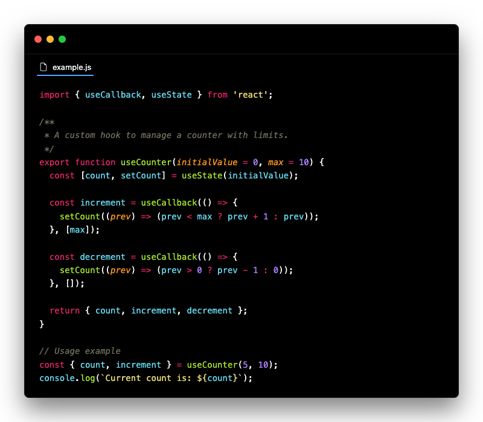
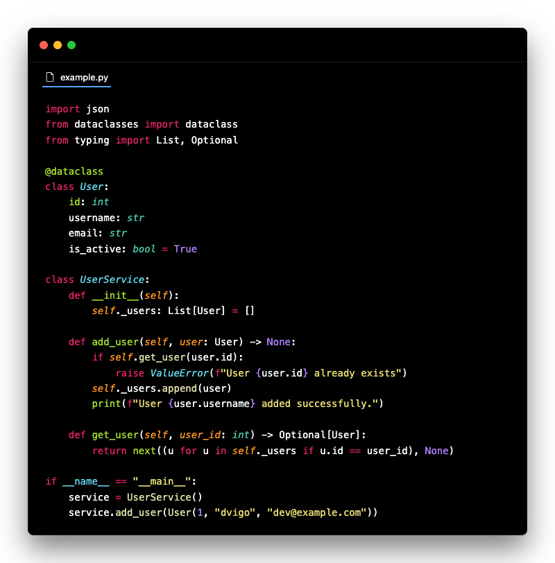
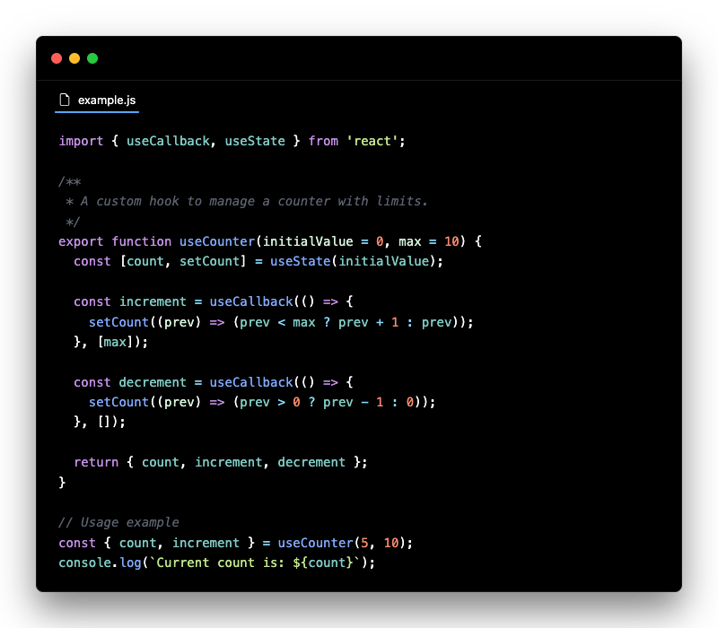
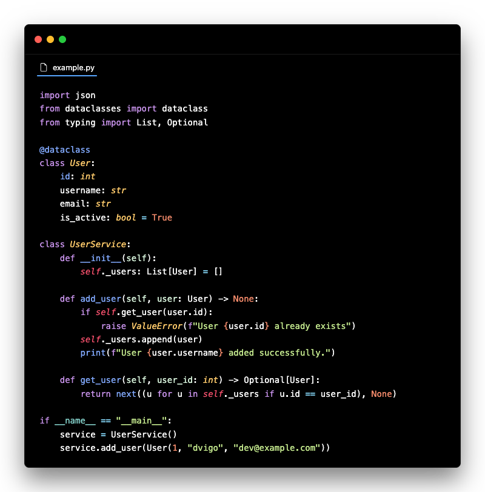
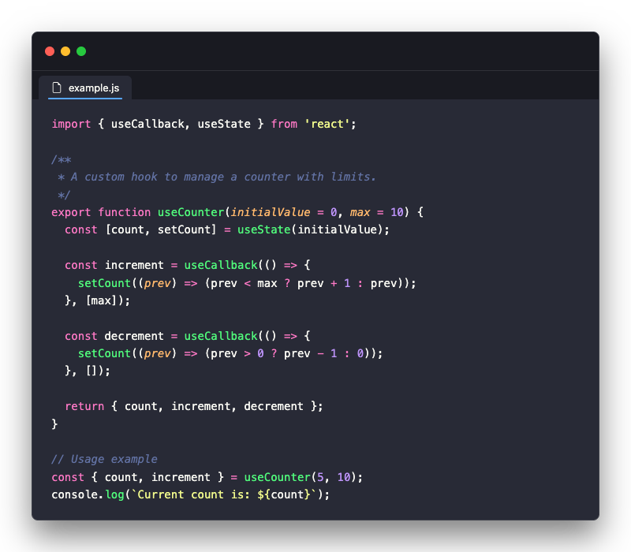
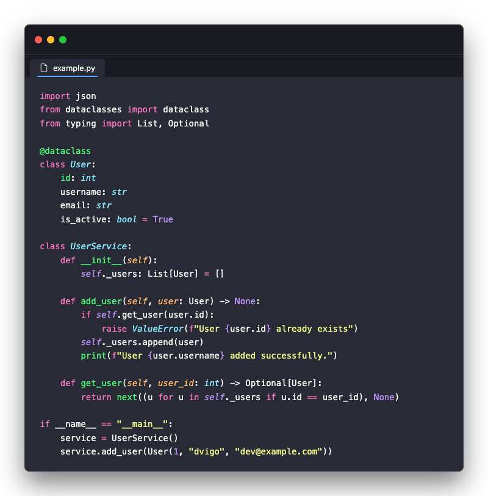

# 🎨 Modern Dark Pro for JetBrains

A professional JetBrains IDE theme designed for developers who value elegance, readability, and extended coding sessions. Featuring three carefully crafted dark variants with optimized colors for perfect contrast and minimal eye strain.

## ✨ Features

- **🌙 Three Dark Variants**: Monokai, Night, and Dracula themes for different preferences
- **🎨 Professional Design**: Clean, modern aesthetic suitable for any development style
- **👁️ Eye-Friendly**: Optimized colors to reduce strain during extended sessions
- **♿ Accessible**: High contrast ratios for excellent readability
- **⚙️ Customizable**: Easy to extend with custom settings

## 🎨 Theme Variants

### Modern Dark Pro - Monokai
Classic Monokai color scheme with modern refinements. Perfect for developers familiar with Monokai, offering vibrant accent colors and excellent contrast for syntax elements.

**Key Colors:**
- Primary Blue: `#58a6ff`
- Success Green: `#3fb950`
- Warning Orange: `#d29922`
- Error Red: `#f85149`
- Purple Accent: `#d2a8ff`

### Modern Dark Pro - Night
Sleek dark theme optimized for low-light environments. Subtle, professional color palette designed for extended work sessions with minimal eye strain.

### Modern Dark Pro - Dracula
A beautiful, contrast-rich theme inspired by the official Dracula Theme. Featuring vibrant pastel colors on a sleek, dark background for maximum readability and a premium developer aesthetic.

**Key Colors:**
- Background: `#282a36`
- Foreground: `#f8f8f2`
- Keyword: `#ff79c6`
- Function: `#50fa7b`
- Constant/Number: `#bd93f9`

## 🖼️ Screenshots

### Monokai Variant

### Night Variant

### Dracula Variant

## 📦 Installation

### From JetBrains Marketplace

1. Open your JetBrains IDE (IntelliJ IDEA, PyCharm, WebStorm, etc.)
2. Go to **Settings/Preferences → Plugins → Marketplace**
3. Search for **"Modern Dark Pro"**
4. Click **Install**
5. Restart your IDE
6. Go to **Settings/Preferences → Appearance → Theme** and select your preferred variant

### Manual Installation

1. Download the theme files from the [releases page](https://github.com/dvigo/modern-dark-pro-jetbrains/releases)
2. Place the theme files in your JetBrains config directory:
   - **macOS**: `~/Library/Application Support/JetBrains/{IDE}/colors/`
   - **Linux**: `~/.config/JetBrains/{IDE}/colors/`
   - **Windows**: `%APPDATA%\JetBrains\{IDE}\colors\`
3. Restart your IDE
4. Go to **Settings/Preferences → Appearance → Theme** and select the theme

## 🚀 Quick Start

1. **Install** the theme from the marketplace
2. **Open** Settings/Preferences (`Cmd+,` / `Ctrl+Alt+S`)
3. **Navigate** to Appearance → Theme
4. **Select** either:
   - `Modern Dark Pro - Monokai`
   - `Modern Dark Pro - Night`
   - `Modern Dark Pro - Dracula`

## 🎯 Supported IDEs

- IntelliJ IDEA
- PyCharm
- WebStorm
- PhpStorm
- RubyMine
- CLion
- Rider
- GoLand
- Android Studio
- And more...

## 📋 Compatibility

- **JetBrains IDEs**: 2020.1 and above
- **Platforms**: Windows, macOS, Linux

## 🤝 Contributing

Contributions are welcome! If you have suggestions for improvements or find any issues:

1. Fork the repository
2. Create your feature branch (`git checkout -b feature/amazing-improvement`)
3. Commit your changes (`git commit -m 'Add amazing improvement'`)
4. Push to the branch (`git push origin feature/amazing-improvement`)
5. Open a Pull Request

For more details, see [CONTRIBUTING.md](CONTRIBUTING.md)

## 📚 Documentation

- [CHANGELOG.md](CHANGELOG.md) - Version history and updates
- [DEVELOPMENT.md](DEVELOPMENT.md) - Development guidelines
- [COLORS.md](COLORS.md) - Complete color palette documentation

## 📝 Changelog

See [CHANGELOG.md](CHANGELOG.md) for a complete list of changes in each version.

### v1.1.0
- Added Dracula theme variant
- Updated documentation and color palette specifications

### v1.0.0 (Initial Release)
- Professional dark theme with two variants
- Comprehensive IDE support
- High contrast compliance
- Optimized for extended sessions

## 📄 License

MIT License - Feel free to use this theme in your projects!

See [LICENSE](LICENSE) file for details.

## 👨‍💻 Author

**dvigo**

- GitHub: [@dvigo](https://github.com/dvigo)
- Marketplace: [dvigo](https://plugins.jetbrains.com/author/dvigo)

## 🙏 Acknowledgments

- Inspired by professional development environments and modern UI design
- Color palette influenced by GitHub's Primer design system and Monokai legacy
- Built with love for the JetBrains community

## 💬 Feedback

- 🐛 Found a bug? [Open an issue](https://github.com/dvigo/modern-dark-pro-jetbrains/issues)
- 💡 Have a suggestion? [Start a discussion](https://github.com/dvigo/modern-dark-pro-jetbrains/discussions)
- ⭐ Enjoy the theme? [Leave a star](https://github.com/dvigo/modern-dark-pro-jetbrains)

---

**Enjoy coding with Modern Dark Pro! 🎨✨**

If you like this theme, please consider:
- ⭐ Starring the repository
- 📣 Sharing it with your friends
- 💬 Leaving feedback or suggestions
- 🐛 Reporting issues or suggesting improvements

**Modern Dark Pro v1.1.0** - Professional Theme for JetBrains IDEs
